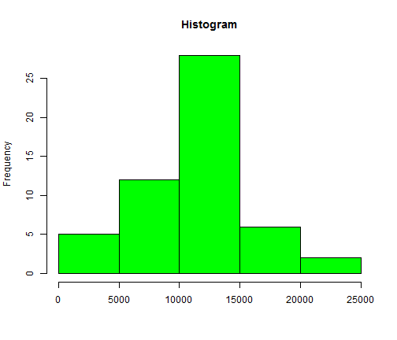

Reproducible Research/ Peer Assessment 1
========================================================
This assignment makes use of data from a personal activity monitoring device. This device collects data at 5 minute intervals through out the day. The data consists of two months of data from an anonymous individual collected during the months of October and November, 2012 and include the number of steps taken in 5 minute intervals each day.

**The variables included in this dataset are:**

-**steps**: Number of steps taking in a 5-minute interval (missing values are coded as NA)

-**date**: The date on which the measurement was taken in YYYY-MM-DD format

-**interval**: Identifier for the 5-minute interval in which measurement was taken

The dataset is stored in a comma-separated-value (CSV) file and there are a total of 17,568 observations in this dataset.

## 1.Loading and preprocessing the data

We use read.csv to read the data from file. The wroking directory is set to the folder which includes the data. Also we use "as.Date" function to convert the data to the class "Date". 
Here we can see the code and first few rwos of the data as well as the number of observations which is  17568.

```r
data <- read.csv("./activity.csv", sep = ",")
data$date <- as.Date(data$date, "%Y-%m-%d")
head(data)
```

```
##   steps       date interval
## 1    NA 2012-10-01        0
## 2    NA 2012-10-01        5
## 3    NA 2012-10-01       10
## 4    NA 2012-10-01       15
## 5    NA 2012-10-01       20
## 6    NA 2012-10-01       25
```

```r
nrow(data)
```

```
## [1] 17568
```


## 2.What is mean total number of steps taken per day?

In order to reshape the data to calculate the total number of steps taken per day we would like to use the "melt" and "dcast" functions, consequently we need to install and load the "reshape2" package.

*Note that in this section we can ignore the NA values.*

Now we can "melt" the data and calculate the sum for our variable values and create a new data frame:


```r
install.packages("reshape2")
```

```
## Error: trying to use CRAN without setting a mirror
```

```r
library(reshape2)
datamelt <- melt(data, id = c("date"), measure.vars = c("steps"), na.rm = TRUE)
data_sum <- dcast(datamelt, date ~ variable, sum)
head(data_sum)
```

```
##         date steps
## 1 2012-10-02   126
## 2 2012-10-03 11352
## 3 2012-10-04 12116
## 4 2012-10-05 13294
## 5 2012-10-06 15420
## 6 2012-10-07 11015
```


Now with our new data frame we can create our histogram of the total number of steps taken each day:


```r
hist(data_sum$steps, col = "green", xlab = "", main = "Histogram")
```

 


The mean and the median total number of steps taken per day are calculated as below: 

```r
mean(data_sum$steps)
```

```
## [1] 10766
```


```r
median(data_sum$steps)
```

```
## [1] 10765
```


## 3.What is the average daily activity pattern?

In this part we would like to find the 5-minute interval which contains the maximum number of steps on average basis for two months. First, we use "melt" and "dcats" finction to create a new data frame which includes average of number of steps for each interval through all days in the study:


```r
datamelt2 <- melt(data, id = c("interval"), measure.vars = c("steps"), na.rm = TRUE)
interval <- dcast(datamelt2, interval ~ variable, mean)
head(interval)
```

```
##   interval   steps
## 1        0 1.71698
## 2        5 0.33962
## 3       10 0.13208
## 4       15 0.15094
## 5       20 0.07547
## 6       25 2.09434
```


```r
plot(interval$interval, interval$steps, type = "l", xlab = "Intervals", ylab = "Average of Steps", 
    col = "blue", lwd = 2)
```

 


Now we can easily find the 5-minute interval in which our subject is most active: 

```r
interval[interval$steps == max(interval$steps), 1]
```

```
## [1] 835
```

```r
(interval[interval$steps == max(interval$steps), 1])/5
```

```
## [1] 167
```

Which is our 167th interval and is around 13:54. 

## 4.Imputing missing values
We should find a way to replace the NA values and do all the calculations again and compare the results. 
First, we are calculating the number of missing values: 

```r
data1 <- data[complete.cases(data$steps), ]
nrow(data)
```

```
## [1] 17568
```

```r
nrow(data1)
```

```
## [1] 15264
```

```r
No_of_missing <- nrow(data) - nrow(data1)
No_of_missing
```

```
## [1] 2304
```


Our strategy to replace the NA values is to replace them with the average of steps through all days for each interval, for example if we have missing values for interval 10 for the day of 2012-10-01 and 2012-10-02, they both will be replaced by a same value. 

```r
newData <- data
for (i in 1:nrow(newData)) {
    if (is.na(newData[i, 1])) {
        newData[i, 1] <- interval[(interval[, 1] == newData[i, 3]), 2]
    }
}
head(newData)
```

```
##     steps       date interval
## 1 1.71698 2012-10-01        0
## 2 0.33962 2012-10-01        5
## 3 0.13208 2012-10-01       10
## 4 0.15094 2012-10-01       15
## 5 0.07547 2012-10-01       20
## 6 2.09434 2012-10-01       25
```

Now we use the same method to creat the histogram for the new data set where the NA values were replaced : 

```r
new_datamelt <- melt(newData, id = c("date"), measure.vars = c("steps"), na.rm = TRUE)
new_data_sum <- dcast(new_datamelt, date ~ variable, sum)
```


```r
hist(new_data_sum$steps, col = "pink", xlab = "", main = "Histogram2 (NA values replaced)")
```

 


```r
mean(new_data_sum$steps)
```

```
## [1] 10766
```

```r
median(new_data_sum$steps)
```

```
## [1] 10766
```


If we compare the new values with those from section 2: 

```
## [1] 10766
```

```
## [1] 10765
```

*We will see that there is not a big difference between them. We can conclude that ignoring the NA values does not have a huge effect on our analysis.*

## 5.Are there differences in activity patterns between weekdays and weekends?


```r
factorData <- data
factorData$date <- weekdays(factorData$date)
head(factorData)
```

```
##   steps   date interval
## 1    NA Monday        0
## 2    NA Monday        5
## 3    NA Monday       10
## 4    NA Monday       15
## 5    NA Monday       20
## 6    NA Monday       25
```

```r
tail(factorData)
```

```
##       steps   date interval
## 17563    NA Friday     2330
## 17564    NA Friday     2335
## 17565    NA Friday     2340
## 17566    NA Friday     2345
## 17567    NA Friday     2350
## 17568    NA Friday     2355
```


```r
for (i in 1:nrow(factorData)) {
    if (factorData[i, 2] == "Sunday" | factorData[i, 2] == "Saturday") {
        factorData[i, 2] <- "weekend"
    } else {
        factorData[i, 2] <- "weekdays"
    }
}
head(factorData)
```

```
##   steps     date interval
## 1    NA weekdays        0
## 2    NA weekdays        5
## 3    NA weekdays       10
## 4    NA weekdays       15
## 5    NA weekdays       20
## 6    NA weekdays       25
```


```r
library(lattice)
plot <- xyplot(factorData$steps ~ factorData$interval | factorData$date, data = factorData, 
    layout = c(1, 2), type = "l", xlab = "Interval", ylab = "Number of Steps")
print(plot)
```

 

